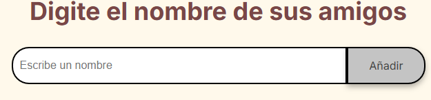
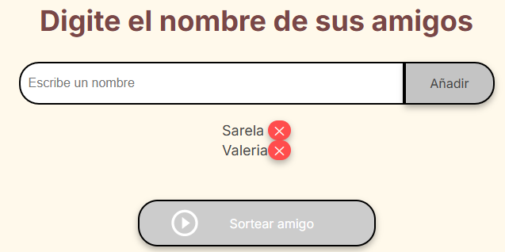
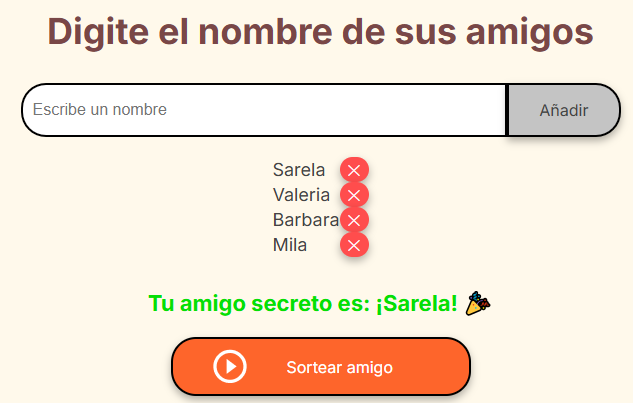
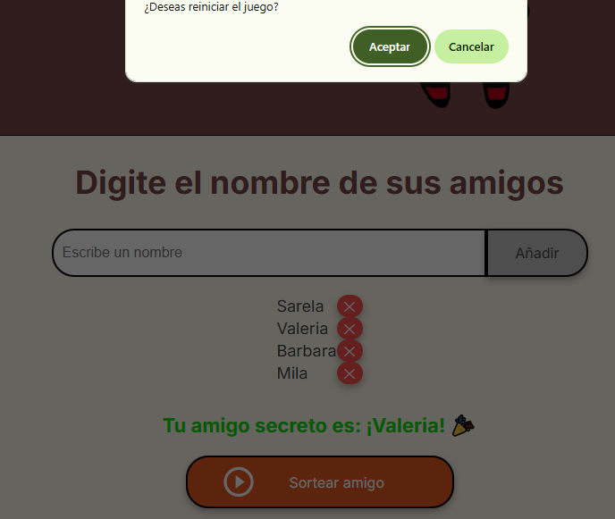

## **Challenge de Amigo Secreto**

Una aplicación web sencilla para organizar un juego de Amigo Secreto, que permite agregar amigos, asignar un Amigo Secreto aleatoriamente y gestionar la lista.

## Características
- **Agregar Amigos**: Escribe un nombre en el campo de entrada y haz clic en "Agregar".

    

- **Ver Lista**: La lista de amigos se actualiza automáticamente debajo del campo de entrada.

- **Eliminar Amigos**: Haz clic en el botón ✕ junto al nombre de un amigo para eliminarlo.

    

- **Sortear Amigo**: Haz clic en el botón "Sortear" (habilitado con 4+ amigos) para seleccionar un amigo aleatoriamente.

    

- **Reiniciar Juego**: Tras el sorteo, elige reiniciar el juego mediante una confirmación.

    

## Limitaciones
- Requiere al menos 4 amigos para realizar un sorteo.
- La entrada de nombres está restringida a letras y espacios (2-50 caracteres).

